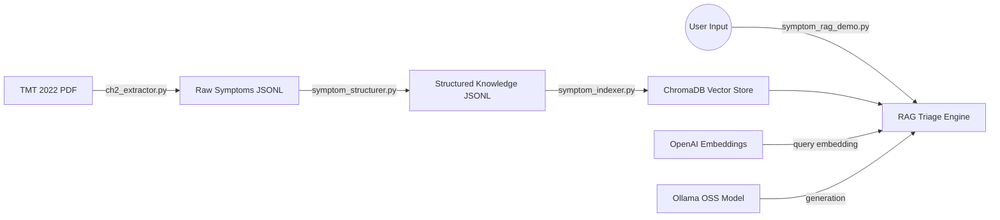

# HealthNav AI – Clinical Reasoning Engine
## Branch: `llms/ragSystem/gpt-oss-120b`

> **Experiment:** Replacing the closed-source GPT-4o generation model with a locally-served open-source model via Ollama. Embeddings remain on OpenAI to stay consistent with the existing ChromaDB index.

---

## What's Different From `closedSourceModel`

| Component | `closedSourceModel` | `gpt-oss-120b` (this branch) |
| :--- | :--- | :--- |
| **Embeddings** | OpenAI `text-embedding-3-small` | OpenAI `text-embedding-3-small` (unchanged) |
| **Generation** | OpenAI `gpt-4o` | Local OSS model via Ollama |
| **API calls** | Fully cloud | Embeddings cloud, generation local |
| **Data privacy** | Symptoms sent to OpenAI | Symptoms stay on-device |
| **Cost** | Per-token billing for generation | Free (local inference) |

---

## Setup

### Prerequisites
- Python 3.8+
- [Ollama](https://ollama.ai) installed and running
- Your model pulled in Ollama:
  ```bash
  ollama pull gpt-oss-120b
  ```
- A `.env` file with:
  ```
  OPENAI_API_KEY=sk-...

  # Ollama config (defaults shown)
  OLLAMA_BASE_URL=http://localhost:11434/v1
  OLLAMA_MODEL=gpt-oss-120b
  ```

### Install dependencies
```bash
pip install -r requirements.txt
```

---

## Pipeline Architecture

The extraction and indexing stages are identical to `closedSourceModel`. Only the final query step changes.



---

## Running the Pipeline

1. **Extract Data** (if not already done):
   ```bash
   python ch2_extractor.py
   ```

2. **Structure Data**:
   ```bash
   python symptom_structurer.py
   ```

3. **Build Index**:
   ```bash
   python symptom_indexer.py
   ```

4. **Test Triage with OSS model**:
   ```bash
   python symptom_rag_demo.py
   ```

---

## What to Evaluate on This Branch

- Does the OSS model follow the structured output format?
- Does it stay grounded in retrieved chunks without hallucinating?
- Does it correctly identify red flags and urgency levels?
- How does response quality compare to GPT-4o on the same queries?

---

## Future Improvements
- **Agent Integration**: Connect this RAG engine to the Intake and Logistics agents.
- **Condition Layer**: Implement similar structuring for disease-specific chapters (handled by `tmt_extract.py`).
- **Evaluation**: Build an automated eval set to measure retrieval accuracy and triage safety across model variants.
