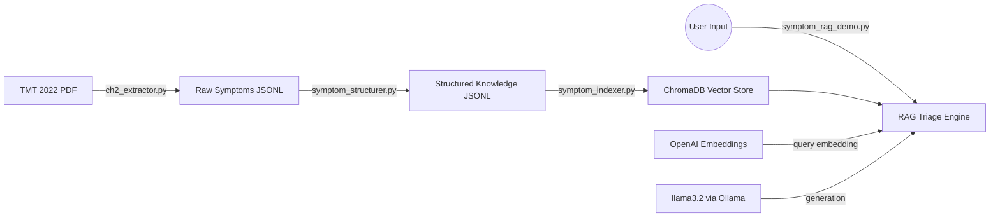

# HealthNav AI – Clinical Reasoning Engine
## Branch: `llms/ragSystem/gpt-oss-120b`

> **Experiment:** Using `llama3.2` (3.2B, already downloaded) as the local generation engine via Ollama. This is the baseline OSS branch — the first test of replacing GPT-4o with a local model.

---

## What's Different From `closedSourceModel`

| Component | `closedSourceModel` | `gpt-oss-120b` (this branch) |
| :--- | :--- | :--- |
| **Embeddings** | OpenAI `text-embedding-3-small` | OpenAI `text-embedding-3-small` (unchanged) |
| **Generation** | OpenAI `gpt-4o` | `llama3.2` via Ollama (local) |
| **API calls** | Fully cloud | Embeddings cloud, generation local |
| **Data privacy** | Symptoms sent to OpenAI | Symptoms stay on-device |
| **Cost** | Per-token billing for generation | Free (local inference) |

---

## Model Details

| Property | Value |
|---|---|
| **Model** | `llama3.2` |
| **Parameters** | 3.2 billion |
| **Download size** | 2 GB (already downloaded) |
| **Min RAM** | 8 GB |
| **Served via** | Ollama at `http://localhost:11434/v1` |

---

## Setup

### Start Ollama (model already downloaded)
```bash
ollama serve
```

### `.env` file
```
OPENAI_API_KEY=sk-...

OLLAMA_MODEL=llama3.2
```

### Install dependencies
```bash
pip install -r requirements.txt
```

---

## Pipeline Architecture

The extraction and indexing stages are identical to `closedSourceModel`. Only the final query step changes.



---

## Running the Pipeline

1. **Extract Data** (if not already done):
   ```bash
   python ch2_extractor.py
   ```

2. **Structure Data**:
   ```bash
   python symptom_structurer.py
   ```

3. **Build Index**:
   ```bash
   python symptom_indexer.py
   ```

4. **Run triage demo:**
   ```bash
   python symptom_rag_demo.py
   ```

---

## What to Evaluate on This Branch

- Does `llama3.2` follow the structured triage output format?
- Does it stay grounded in retrieved chunks without hallucinating?
- Does it correctly identify red flags and urgency levels?
- How does a 3.2B model compare to GPT-4o on the same queries?

---

## Future Improvements
- **Agent Integration**: Connect this RAG engine to the Intake and Logistics agents.
- **Condition Layer**: Implement similar structuring for disease-specific chapters (handled by `tmt_extract.py`).
- **Evaluation**: Build an automated eval set to measure retrieval accuracy and triage safety across model variants.
